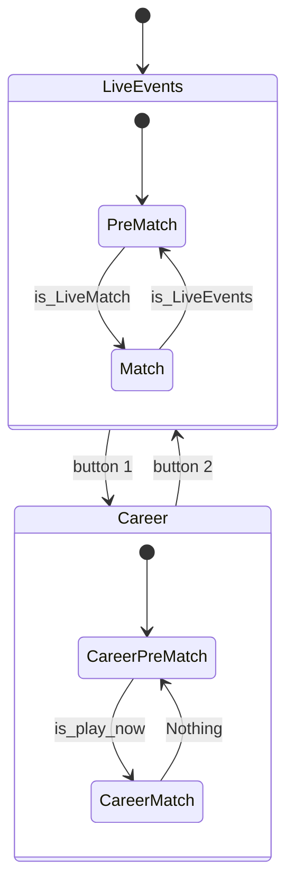

---

# My Project

This project is made for free Dream League Soccer automation play. Dont expect too much, because it just some basic click, dont have AI support to play this game.

---

## Table of Contents
- [My Project](#my-project)
  - [Table of Contents](#table-of-contents)
  - [Project Structure](#project-structure)
  - [Finite State Machine (FSM) Overview](#finite-state-machine-fsm-overview)
  - [Key Files and Functionality](#key-files-and-functionality)
  - [Usage](#usage)
  - [Adding Tasks](#adding-tasks)
  - [Appendix](#appendix)
    - [Change Private DNS Settings in BlueStacks](#change-private-dns-settings-in-bluestacks)
    - [Restart ADB](#restart-adb)
  - [Notes on `transitions` Usage](#notes-on-transitions-usage)

---

## Project Structure

```plaintext
my_project/
├── main.py
├── fsm/
│   ├── __init__.py
│   ├── config.py            # Contains 'states' list & 'transitions' list
│   └── model.py             # Contains the GameModel class
├── library/
│   ├── __init__.py
│   └── capture.py           # Utilities (e.g., capture_screenshot)
├── global_variables.py
└── requirements.txt         # Dependencies: transitions, pillow, pytesseract, etc.
```

---

## Finite State Machine (FSM) Overview

Below is a simplified representation of the FSM using Mermaid syntax. It shows how **LiveEvents** and **Career** states transition between `PreMatch` and `Match`.



---

## Key Files and Functionality

1. **`fsm/config.py` (States & Transitions)**
   - Defines the **structure** of the FSM (lists of `states` and `transitions`).
   - **Does not** create the machine instance; it serves purely as configuration data.

2. **`fsm/model.py` (FSM Model Class)**
   - Contains the **`GameModel`** class, which implements FSM logic and transitions.
   - Includes methods (e.g., `is_LiveEvents_cond()`) used as **conditions** for transitions in the `transitions` library.
   - Imports variables like `adb_device_id` and `screenshot_path` from `global_variables.py`.
   - Performs ADB taps based on conditions, returning `True` if a transition is allowed.

3. **`library/capture.py` (Utility Functions)**
   - Provides helper functions (e.g., `capture_screenshot`) to interact with an ADB environment.
   - Useful for capturing screenshots or other utility tasks needed in the FSM flow.

4. **`fsm/task.py` (Tasks Defined by User)**
   - Placeholder file (or module) where users can define additional tasks or states for the FSM.

---

## Usage

1. Review and update **`global_variables.py`** to ensure it matches your device name (e.g., `adb_device_id`) and other environment paths (`screenshot_path`).
2. Install the required dependencies listed in **`requirements.txt`**:
   ```bash
   pip install -r requirements.txt
   ```
3. (Optional) Update or customize the `states` and `transitions` in **`fsm/config.py`** as needed.
4. Run the main script:

```bash
python main.py
```
---

## Adding Tasks

To define a new task:

1. Open `fsm/task.py` and add your task logic or functions.  
2. (Optional) Use `find_location.py` (if you have it) to find screen coordinates for ADB taps.  
3. Update `main.py` to call your new tasks or transitions in the appropriate places.

---

## Appendix

### Change Private DNS Settings in BlueStacks

If you’re using BlueStacks and want to block ads by changing the private DNS settings, run:

```bash
adb -s emulator-5554 shell settings put global private_dns_mode hostname
adb -s emulator-5554 shell settings put global private_dns_specifier dns.adguard.com
adb -s emulator-5554 shell settings put global private_dns_mode off
```

### Restart ADB

```bash
adb kill-server
adb start-server
```

---

## Notes on `transitions` Usage

We use the [**transitions**](https://github.com/pytransitions/transitions) library to model our automaton (finite state machine). Each **transition** (edge) has:

1. A **trigger** (e.g., `to_match` or `button1`)  
2. A **source** state (where it starts)  
3. A **destination** state (where it ends)  
4. (Optional) **condition(s)** (boolean functions checked before the transition occurs)

When you call a trigger method (e.g., `model.to_match()`), `transitions` checks:

- Is the **current state** the same as the transition’s source?  
- Are the **condition(s)** satisfied?  

If both are true, the FSM transitions to the destination state. Otherwise, it fails (raising a `MachineError`).

---
